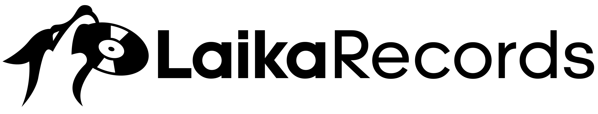

<!-- PROJECT LOGO -->
 

  

  <h3 align="center">Laika Records</h3>

  

    My first web application project!
     
    <a href="https://laika-records.web.app/home"><strong>View Live</strong></a>
     
     
   
  

<!-- ABOUT THE PROJECT -->
## About The Project

 

 

This is my first web app developed completely independently used to graduate from Epicode's Front end web developer course.

This project was born out of my passion for music.
Inspired by the courageous spirit of Laika, the first living creature to journey into space, we aim to explore uncharted musical territories. Our mission is to blend the timeless charm of vinyl with the convenience of modern technology, making the vinyl experience more accessible and enjoyable for everyone. :grin: :star:  :rocket:

This project is used for demonstration purposes only.

### Built With

* 
* 
* 
* Discogs API

<!-- USAGE EXAMPLES -->
## Usage
If you want to try the site without registering, you can use the 'trial accoun:

* Email: mariorossi@gmail.com
* Password: 123456

Fake Paypall trial account:

* Email: sb-5dzmc25937528@personal.example.com
* Password: 12345678

<!-- ROADMAP -->
## Roadmap

- [x] Add Header with logo and navbar
- [x] Add Register and Login
- [x] Add Dashboard page 
    - [x] Add page to search records through Discogs API and add to Firebase databse
    - [x] Add database page to edit items
- [x] Add Record page with LP images and information
    - [ ] Add other records of the same author
    - [ ] Add preview of the record's songs
- [x] Add Homepage with banners and sections
- [x] Add Product page with various filter
- [x] Add Profile page
    - [x] Add collections and wanted list
    - [x] Add profile info edit and delete function
- [x] Add search bar to search Artist and Records
- [x] Add Cart page with smart Paypall buttons
- [ ] Add About page
- [ ] Add Footer

<!-- CONTACT -->
## Contact

Nicolas Mastropietro -  nicolas94.m@gmail.com

Linkedin profile: https://www.linkedin.com/in/nicolas-mastropietro-front-end-web-developer/

Project Link: [https://github.com/sigurnick/Laika-Records](https://github.com/sigurnick/Laika-Records)

<!-- MARKDOWN LINKS & IMAGES -->
<!-- https://www.markdownguide.org/basic-syntax/#reference-style-links -->
[contributors-shield]: https://img.shields.io/github/contributors/othneildrew/Best-README-Template.svg?style=for-the-badge
[contributors-url]: https://github.com/othneildrew/Best-README-Template/graphs/contributors
[forks-shield]: https://img.shields.io/github/forks/othneildrew/Best-README-Template.svg?style=for-the-badge
[forks-url]: https://github.com/othneildrew/Best-README-Template/network/members
[stars-shield]: https://img.shields.io/github/stars/othneildrew/Best-README-Template.svg?style=for-the-badge
[stars-url]: https://github.com/othneildrew/Best-README-Template/stargazers
[issues-shield]: https://img.shields.io/github/issues/othneildrew/Best-README-Template.svg?style=for-the-badge
[issues-url]: https://github.com/othneildrew/Best-README-Template/issues
[license-shield]: https://img.shields.io/github/license/othneildrew/Best-README-Template.svg?style=for-the-badge
[license-url]: https://github.com/othneildrew/Best-README-Template/blob/master/LICENSE.txt
[linkedin-shield]: https://img.shields.io/badge/-LinkedIn-black.svg?style=for-the-badge&logo=linkedin&colorB=555
[linkedin-url]: https://linkedin.com/in/othneildrew
[product-screenshot]: images/screenshot.png
[Next.js]: https://img.shields.io/badge/next.js-000000?style=for-the-badge&logo=nextdotjs&logoColor=white
[Next-url]: https://nextjs.org/
[React.js]: https://img.shields.io/badge/React-20232A?style=for-the-badge&logo=react&logoColor=61DAFB
[React-url]: https://reactjs.org/
[Vue.js]: https://img.shields.io/badge/Vue.js-35495E?style=for-the-badge&logo=vuedotjs&logoColor=4FC08D
[Vue-url]: https://vuejs.org/
[Angular.io]: https://img.shields.io/badge/Angular-DD0031?style=for-the-badge&logo=angular&logoColor=white
[Angular-url]: https://angular.io/
[Svelte.dev]: https://img.shields.io/badge/Svelte-4A4A55?style=for-the-badge&logo=svelte&logoColor=FF3E00
[Svelte-url]: https://svelte.dev/
[Laravel.com]: https://img.shields.io/badge/Laravel-FF2D20?style=for-the-badge&logo=laravel&logoColor=white
[Laravel-url]: https://laravel.com
[Bootstrap.com]: https://img.shields.io/badge/Bootstrap-563D7C?style=for-the-badge&logo=bootstrap&logoColor=white
[Bootstrap-url]: https://getbootstrap.com
[JQuery.com]: https://img.shields.io/badge/jQuery-0769AD?style=for-the-badge&logo=jquery&logoColor=white
[JQuery-url]: https://jquery.com 

